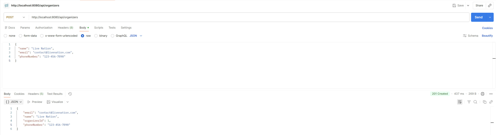

# Event Ticketing System
A RESTful backend API for managing events, venues, organizers, attendees, ticket types, and bookings.

This project demonstrates full 3-layer Spring Boot architecture, JPA entity relationships, DTO mapping, business logic, and PostgreSQL integration.

## Team
| Name                 |       CWID       |
|:---------------------|:----------------:|
| Dianella Sy          |    884931890     |
| Saloni Joshi         |    885584714     |
| Siddharth Vasu       |    885505578     |

## Demo Video

## Postman Screenshots
#### Create a new organizer:

#### Create a new venue:

## Documentation of the API