# Event Ticketing System
A RESTful backend API for managing events, venues, organizers, attendees, ticket types, and bookings.

This project demonstrates full 3-layer Spring Boot architecture, JPA entity relationships, DTO mapping, business logic, and PostgreSQL integration.

## Team
| Name                 |       CWID       |
|:---------------------|:----------------:|
| Dianella Sy          |    884931890     |
| Saloni Joshi         |    885584714     |
| Siddharth Vasu       |    885505578     |

## Demo Video

## Postman Screenshots
### Create a new organizer:
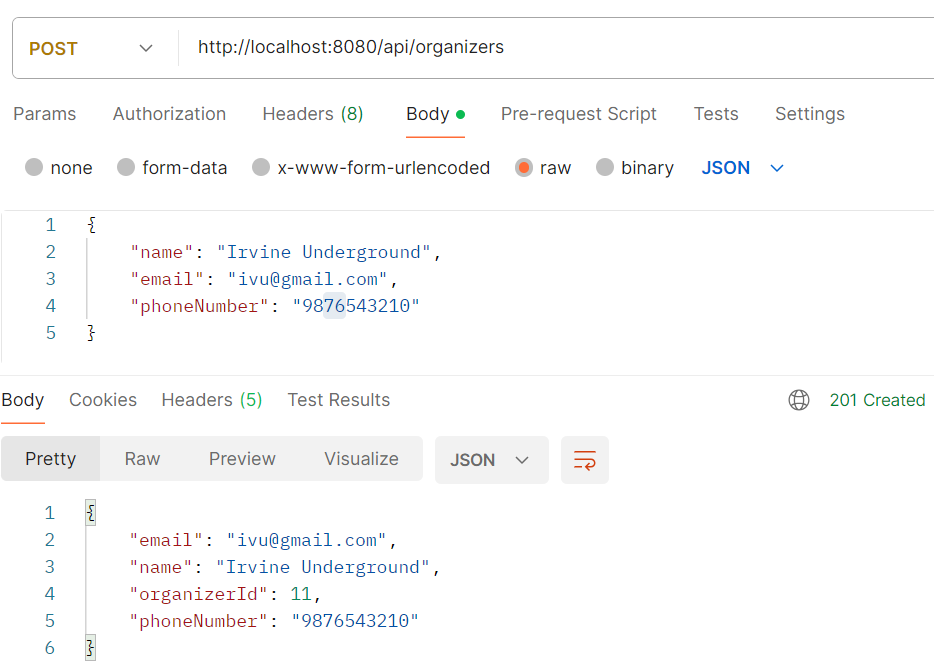

### Create a new venue:
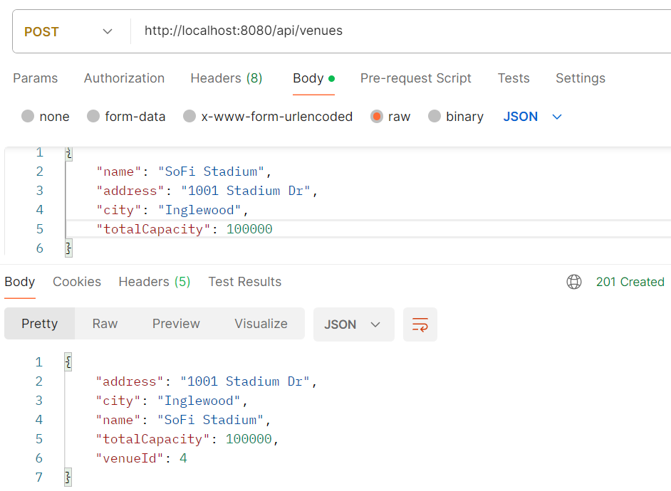

### Create a new event:
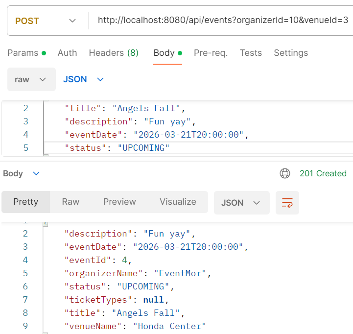

### Create a new ticket type:
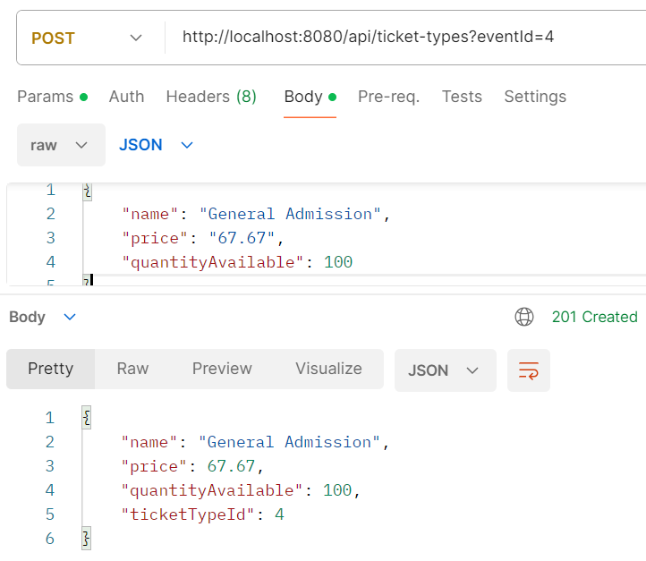

### List all upcoming events:
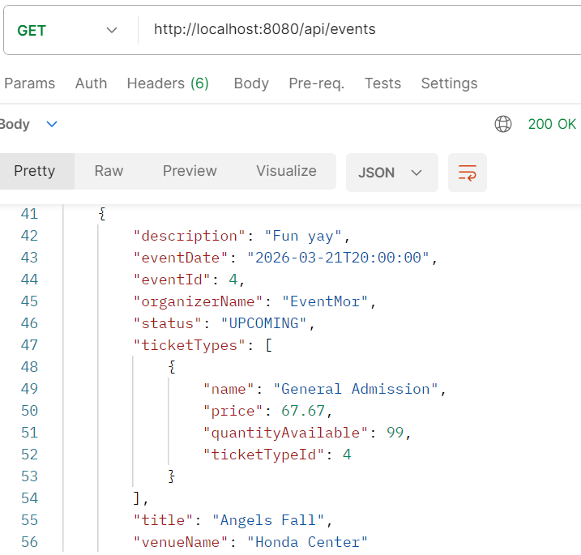

### Get event details with ticket types:
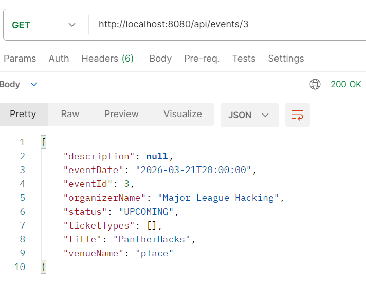

### Register a new attendee:
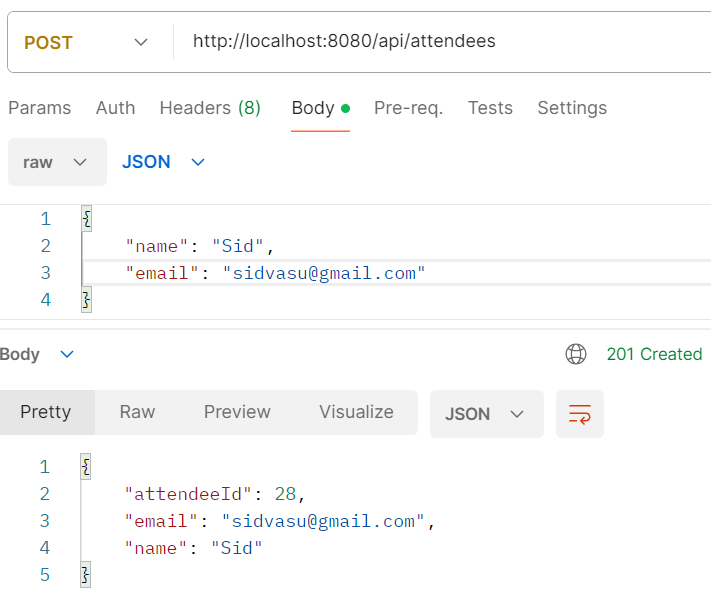

### Book a ticket:
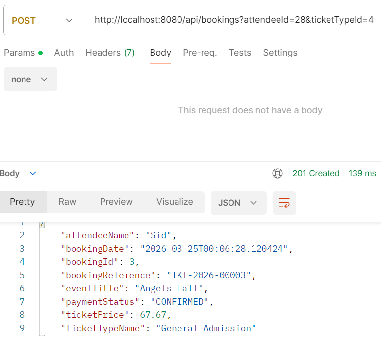

### Cancel a booking:
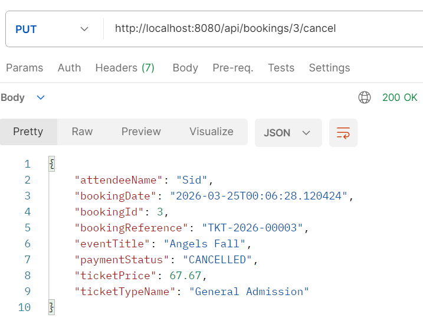

### Get total revenue for an event:
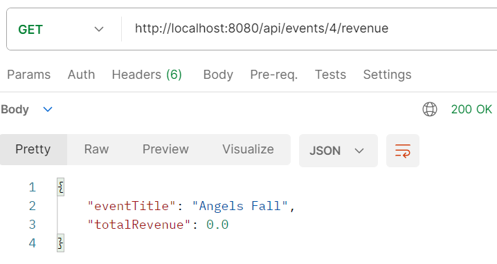

### Get all bookings for an attendee events:
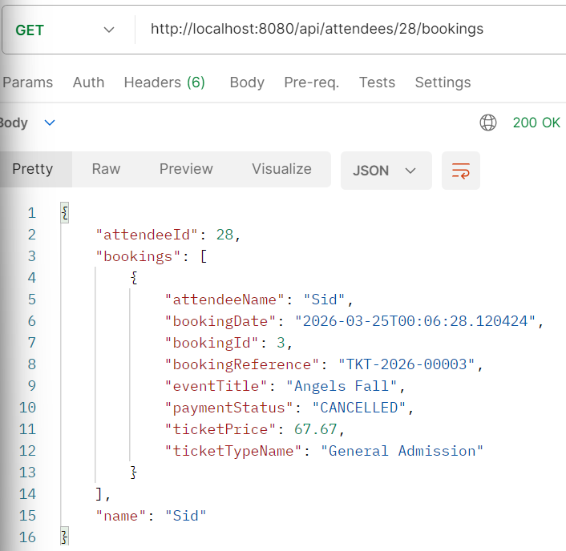

## Documentation of the API
 
### POST /api/organizers
- Create a new organizer
 
**Example request body:**
```json
{
  "name": "EventMor",
  "email": "eventmor@gmail.com",
  "phoneNumber": "123-1234"
}
```
 
### POST /api/venues
- Create a new venue
 
**Example request body:**
```json
{
  "name": "Honda Center",
  "address": "1234 W South St",
  "city": "Anaheim",
  "totalCapacity": 1200
}
```
 
### POST /api/events?organizerId=1&venueId=1
- Create a new event
- Uses request params for `organizerId` and `venueId` since organizers and venues are full objects in the entity, not simple integer fields — passing them as params avoids needing a separate request DTO
- `organizerId` and `venueId` reference existing records in the database
 
**Example request body:**
```json
{
  "title": "Angels Fall",
  "description": "Fun yay",
  "eventDate": "2026-03-21T20:00:00",
  "status": "UPCOMING"
}
```
 
### POST /api/ticket-types?eventId=1
- Not a required endpoint per the project spec
- Added to allow creating ticket types so the booking endpoint can be properly tested
- `eventId` references an existing event
 
**Example request body:**
```json
{
  "name": "General Admission",
  "price": 67.67,
  "quantityAvailable": 100
}
```
 
### POST /api/attendees
- Register a new attendee
- Email must be unique
 
**Example request body:**
```json
{
  "name": "Sid the goat",
  "email": "sidvasu@gmail.com"
}
```
 
### POST /api/bookings?attendeeId=1&ticketTypeId=1
- Book a ticket
- No request body needed — attendee and ticket type are passed as URL params
- Business logic: checks ticket availability, prevents duplicate bookings, decrements quantity, generates booking reference, sets payment status to CONFIRMED
 
### GET /api/events
- Get all upcoming events (status = UPCOMING)
 
### GET /api/events/{id}
- Get event details including ticket types, organizer name, and venue name
 
### PUT /api/bookings/{id}/cancel
- Cancel a booking by ID
- Restores ticket inventory on cancellation
 
### GET /api/events/{id}/revenue
- Get total confirmed revenue for an event
- Uses custom `@Query` to sum ticket prices for all CONFIRMED bookings
 
### GET /api/attendees/{id}/bookings
- Get all bookings for a specific attendee
- Includes event title in response